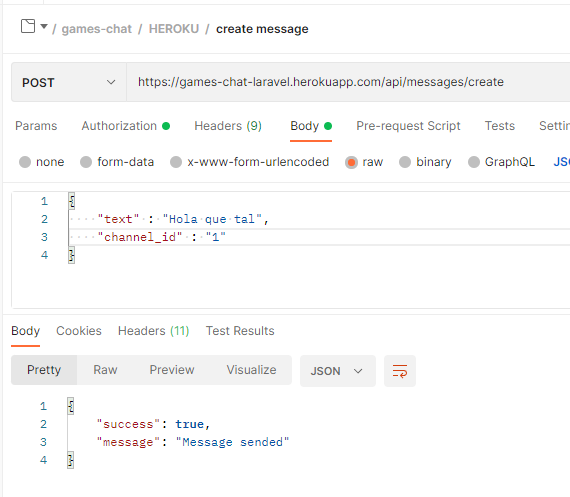

<h1 align="center">
Games Chat
</h1>

___

<h5 align="center">Back-End en Laravel realizado durante el Bootcamp FSD de GeeksHubs. Por José Carlos Núñez.</h5> 

    <a href="#about">About</a> ·
    <a href="#usage">Usage</a> ·
    <a href="#features">Features</a>

___

## About

He desarrollado un Backen-End en Laravel, el cual consiste en simular una aplicación de chat para videojuegos, con varios endpoints en las distintas tablas que pertenecen a la BBDD, con varios CRUD.

---

## Usage

Está desplegada en Heroku, por lo cual, solo tienés que utilizar los Endpoints, que se encuentran en la carpeta Postman en formato JSON y utilizarlos en Postman.

<strong>End-Points de Usuario</strong>

En primer lugar podemos ver el Login.

 
 Login

 
Register, la información de esta imagen, es la que debemos usar si queremos tener permisos de Super Admin.

 
 Register

 

<strong>End-Points de Super Admin y Admin</strong>

Añadir role de admin, para el cual debemos tener role de super Admin.

 
 Add admin role

Eliminar role de admin, para el cual debemos tener role de super Admin.

 
 Delete admin role

Añadir role de super admin, para el cual debemos tener role de super Admin.

 
Add super admin role

Eliminar role de super admin, para el cual debemos tener role de super Admin.

 
 Delete super admin role

<strong>End-Points de Juegos</strong>

El primer endpoint, consiste en crear un juego.

 
 Add game

Este endpoint, consiste en modificar un juego.

 
 Update game

El tercer endpoint, nos muestra todos los juegos disponibles en la BBDD.

 
 Get games

El cuarto endpoint, consiste en eliminar u un juego.

 
 Delete game

<strong>End-Points de Canales</strong>

El primer endpoint, nos permite crear un canal.

 
 Create channel

El segundo endpoint, nos permite eliminar un canal.

 
 Delete channel

El primer endpoint, nos permite unirnos a un canal.

 
 Join to channel

<strong>End-Points de Mensajes</strong>

El primer endpoint, nos permite crear un mensaje.

 
 Create message

El segundo endpoint, nos permite editar un mensaje.

 
 Edit message

El siguiente endpoint, nos muestra los mensajes que hayamos enviado mensaje.

 
 Get message

El ultimo endpoint, nos permite eliminar un mensaje ya enviado.

 
 Delete message

___

##Features

····

